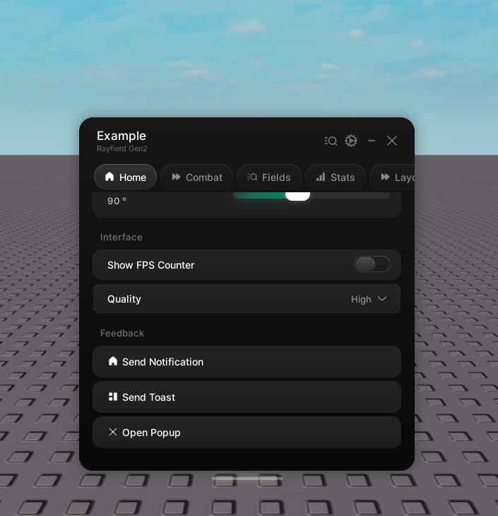

# Button

> Run a function when the player clicks.

A button runs its callback when clicked. That is all it does.



```lua
tab:CreateButton({
    name = "Reset character",
    callback = function()
        game.Players.LocalPlayer.Character:BreakJoints()
    end,
})
```

## Properties

| Property | Type | Description |
| --- | --- | --- |
| `name` | string | The label. |
| `description` | string | Hint text under the label. Optional. |
| `icon` | string \| number | An icon shown beside the label. Optional. |
| `callback` | function | Runs on click. |
