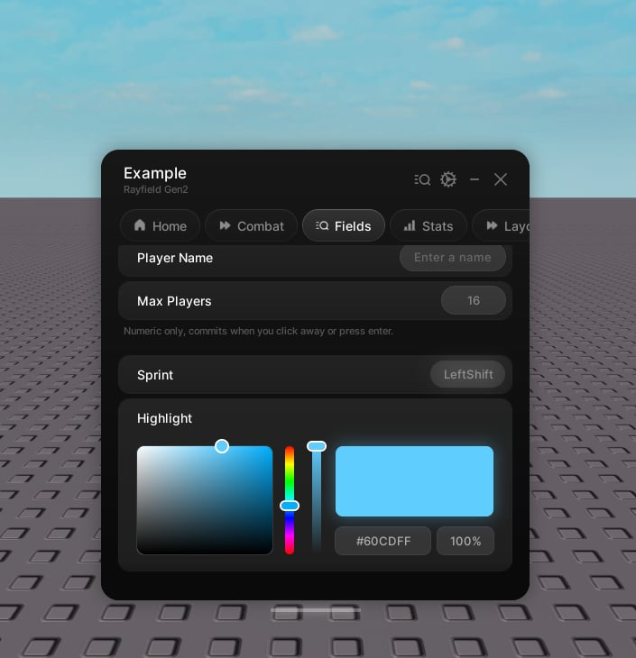

# Color picker

> Pick a colour, and optionally alpha.

A color picker chooses a colour and, if you want it, an alpha. Drag the map and bars, or type into the fields.



```lua
tab:CreateColorPicker({
    name = "Highlight",
    color = Color3.fromRGB(96, 205, 255),
    callback = function(color, alpha)
        print(color, alpha)
    end,
})
```

> [!NOTE]
> Color pickers are full-width and live at the tab level. Create them directly on the tab, not inside a group.

## Properties

| Property | Type | Default | Description |
| --- | --- | --- | --- |
| name | string | | The label. |
| description | string | | Hint text under the label. Optional. |
| icon | string \| number | | An icon shown beside the label. Optional. |
| color | Color3 \| string | | The initial colour. A hex string is accepted. |
| alpha | number | 1 | The initial alpha, from 0 to 1. |
| flag | string | name | The save key. Colour and alpha both persist. Optional. |
| forgetState | boolean | false | Skip saving. |
| callback | function | | Runs with `(color, alpha)` on every change. |

## Handle

| Member | Description |
| --- | --- |
| .value | The current colour. |
| .alpha | The current alpha. |
| Set(color, skipCallback?) | Set the colour. |
| SetAlpha(alpha, skipCallback?) | Set the alpha. |
