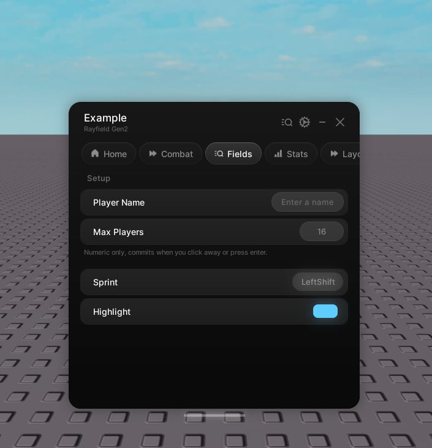

# Keybind

> A rebindable key or mouse button.

A keybind captures a key. Click the box, press a key or mouse button to bind it, and press Backspace to clear.



```lua
tab:CreateKeybind({
    name = "Sprint",
    value = Enum.KeyCode.LeftShift,
    callback = function(key)
        print("Pressed", key)
    end,
})
```

> [!NOTE]
> Keybinds are full-width and live at the tab level. Create them directly on the tab, not inside a group.

## Properties

| Property | Type | Default | Description |
| --- | --- | --- | --- |
| name | string | | The label. |
| description | string | | Hint text under the label. Optional. |
| icon | string \| number | | An icon shown beside the label. Optional. |
| value | EnumItem \| string | | The initial bind. A `KeyCode`, a mouse button, or its name. |
| hold | boolean | false | Hold mode. See below. |
| holdThreshold | number | 0.2 | Seconds to hold before a press counts, in hold mode. |
| flag | string | name | The save key. Optional. |
| forgetState | boolean | false | Skip saving. |
| callback | function | | See below. |
| onChanged | function | | Runs with the new key when the bind itself changes. |

## Hold mode

By default `callback(key)` fires on each press. In hold mode it fires `callback(true)` once the key is held past the threshold and `callback(false)` on release, so a quick tap is ignored.

## Handle

| Member | Description |
| --- | --- |
| .value | The current bind. |
| Set(value, skipChanged?) | Set the bind. Pass `true` as the second argument to skip `onChanged`. |
