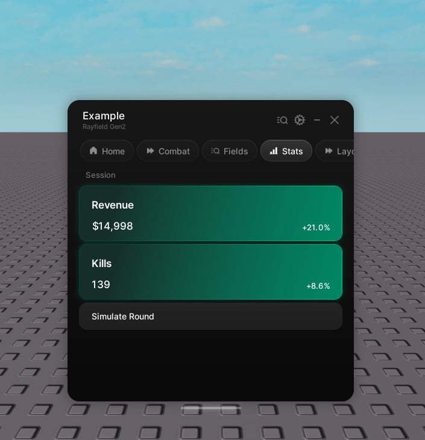

# Stat

> A read-only number that rolls on change and shows how far it moved.

A stat displays a number. When it changes, the digits roll to the new value and a small indicator shows how far it moved. Stats are read-only and do not save.



```lua
local revenue = tab:CreateStat({
    name = "Revenue",
    prefix = "$",
    value = 12400,
})

revenue:Set(revenue.value + 500)
```

## Properties

| Property | Type | Default | Description |
| --- | --- | --- | --- |
| `name` | string | | The label. |
| `description` | string | | Hint text under the label. Optional. |
| `icon` | string \| number | | An icon shown beside the label. Optional. |
| `value` | number | `0` | The initial value. |
| `prefix` | string | `""` | Text before the number. |
| `suffix` | string | `""` | Text after the number. |
| `display` | string | `"value"` | On a compact card, show the `"value"` or the `"change"`. |
| `compact` | boolean | `false` | Show a small card. Forced on inside a row. |
| `changeMode` | string | `"percentage"` | Show the delta as `"percentage"` or `"absolute"`. |
| `changeBaseline` | string | `"previous"` | Measure change from the `"previous"` value or the `"initial"` one. |
| `numberEasing` | boolean | `true` | Roll the digits rather than snap to the new value. |

## Handle

| Member | Description |
| --- | --- |
| `.value` (number) | The current value. |
| `Set(value)` | Set the value. |
| `ResetBaseline(value?)` | Zero the change indicator. |
