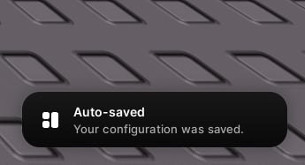
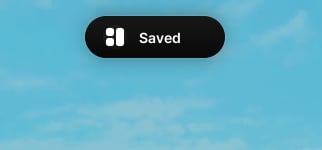

# Notifications and toasts

> Two ways to tell the player something happened.

## Notifications

`window:Notify(props)` shows a card in the bottom-right corner. Hover to pause the timer, click to dismiss.



```lua
window:Notify({
    title = "Auto-saved",
    content = "Your configuration was saved.",
    duration = 5,
})
```

| Property | Type | Description |
| --- | --- | --- |
| `title` | string | The first line. |
| `content` | string | The body text. Wraps. |
| `icon` | string \| number | An icon. |
| `duration` | number | How long it stays on screen, in seconds. |

## Toasts

`window:Toast(props)` drops a pill in from the top centre, newest on top. Use it for quick, low-weight confirmations.



```lua
window:Toast({ title = "Saved", icon = 125823673784681 })

window:Toast({
    title = "Nova",
    subtitle = "joined the server",
    avatar = 1,
})
```

| Property | Type | Description |
| --- | --- | --- |
| `title` | string | The main line. |
| `subtitle` | string | A second line. |
| `subtitleAbove` | boolean | Put the subtitle above the title. |
| `icon` | string \| number | An icon. |
| `avatar` | number | A user id, shown as their headshot. |
| `minWidth` | number | A floor on the width. |
| `duration` | number | How long it stays on screen, in seconds. |
