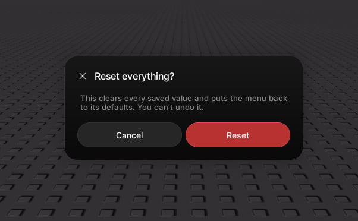

# Popups

> A modal card over a dimmed backdrop. Use it for a decision or a changelog.

`window:Popup(props)` floats a modal card over a dimmed backdrop. Give it `options` for a choice dialog, or `boxes` for a changelog. It returns a handle with `Close()`.



## A choice dialog

```lua
window:Popup({
    title = "Reset everything?",
    content = "This clears every saved value. You can't undo it.",
    options = {
        { text = "Cancel" },
        { text = "Reset", style = "danger", callback = function() end },
    },
})
```

## A changelog

```lua
window:Popup({
    title = "What's new",
    subtitle = "Version 2.1",
    boxes = {
        { title = "Modal popups", description = "A new centred dialog.", icon = 93364949241311 },
        { title = "Faster reveals", description = "Pages open instantly." },
    },
    options = { { text = "Got it", style = "primary" } },
})
```

## Properties

| Property | Type | Default | Description |
| --- | --- | --- | --- |
| `title` | string | `"Popup"` | The heading. |
| `subtitle` | string | | A smaller line beneath the title. |
| `icon` | string \| number | | An icon beside the title. |
| `content` | string | | A body paragraph. Wraps, and scrolls inside the card when long. |
| `boxes` | { box } | | A list of cards, shown instead of a paragraph. Each `box` takes `title`, and optional `description` and `icon`. |
| `options` | { option } | one dismiss button | Footer buttons. Each `option` takes `text`, an optional `style` (`"neutral"`, `"primary"`, or `"danger"`), and an optional `callback` that runs before the popup closes. |
| `dismissable` | boolean | true | Let the player click the backdrop or press Escape to close. |
