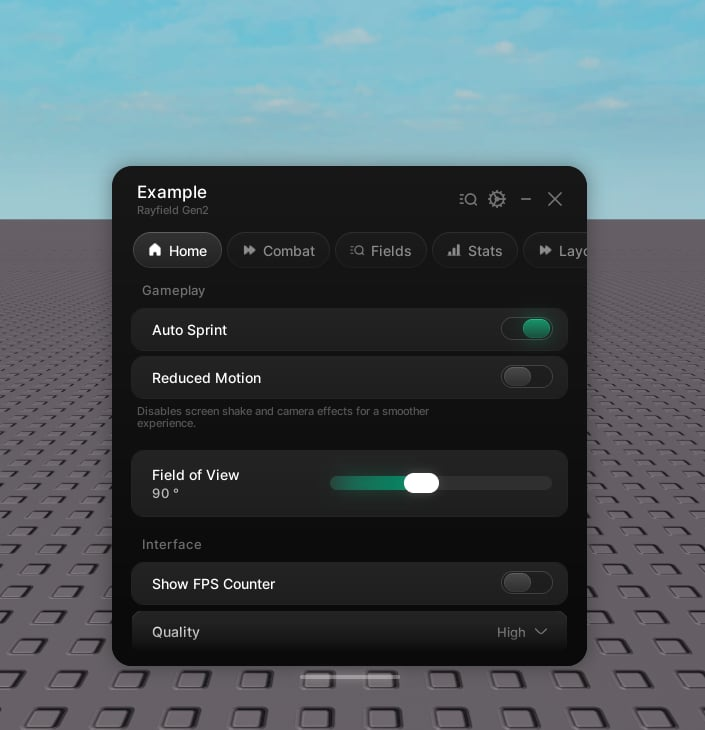

# Windows

> Create a window and control it at runtime. Everything else hangs off the window handle.

`Rayfield:CreateWindow(props)` creates the window and returns its handle. Tabs, tags, notifications, popups, and theme changes all come from that handle.



```lua
local window = Rayfield:CreateWindow({
    name = "Example Hub",
    subtitle = "Rayfield Gen2",
    theme = "cobalt",
})
```

## Properties

| Property | Type | Default | Description |
| --- | --- | --- | --- |
| `name` | string | `"Rayfield Window"` | The window title. |
| `subtitle` | string | | A smaller line beneath the title. |
| `theme` | string \| table | `"default"` | A built-in theme name (`"default"`, `"cobalt"`, `"ember"`, `"amethyst"`, `"frost"`, `"rose"`) or a theme table. See [Themes](themes.md). |
| `icon` | string \| number | | An icon shown beside the title. |
| `configuration` | table | | Enables saving. See [Saving](saving.md). |
| `locale` | string | player's locale | Pins the language. Leave it out to follow the player's Roblox language. See [Localization](localization.md). |
| `translations` | table | | Language tables keyed by locale id. |
| `translator` | function | | A custom resolver used instead of tables. |
| `fallbackFont` | Enum.Font \| Font | BuilderSans | A stand-in font shown in secure mode while the brand font downloads. |

**configuration options**

| Property | Type | Default | Description |
| --- | --- | --- | --- |
| `autoSave` | boolean | | Save on every change. |
| `autoLoad` | boolean | | Load saved state the first time the window opens. |
| `fileName` | string | window name | Name of the saved file. |
| `customFolder` | string | | Optional folder to keep the file in. |

## Methods

The window handle exposes everything you need at runtime.

### Building

| Method | Returns | Description |
| --- | --- | --- |
| `CreateTab(props)` | Tab | Add a tab. See [Tabs and groups](tabs.md). |
| `CreateTag(props)` | Tag | Add a pill beside the title. See [Tags](tags.md). |

### Messages

| Method | Returns | Description |
| --- | --- | --- |
| `Notify(props)` | | Show a notification card in the corner. See [Notifications](notifications.md). |
| `Toast(props)` | | Drop a toast in from the top. See [Notifications](notifications.md). |
| `Popup(props)` | Popup | Float a modal dialog or changelog over a dimmed backdrop. See [Popups](popups.md). |

### Visibility

| Method | Description |
| --- | --- |
| `Show()` | Reveal the window. |
| `Hide()` | Collapse the window. |
| `ToggleHide()` | Toggle between shown and hidden. |
| `ToggleMinimise()` | Collapse to the top bar. |
| `Navigate(tab)` | Jump to a tab by its handle or name. |
| `Unload()` | Destroy the interface. |

### Theme and language

| Method | Description |
| --- | --- |
| `ChangeTheme(theme)` | Restyle everything at runtime. Colours and sizes tween across. |
| `SetLocale(id)` | Switch every label to another language live. |
| `SetTranslator(fn)` | Swap the copy resolver. |
| `RegisterTranslations(t)` | Add a language pack at runtime. |

### Saving

| Method | Returns | Description |
| --- | --- | --- |
| `Save(name?)` | boolean | Save now. Pass a name to target a saved configuration, or leave it out for the default file. |
| `Load(name?)` | boolean | Load now. |
| `ListConfigs()` | { string } | Names of the saved configurations. |
| `DeleteConfig(name)` | boolean | Delete a saved configuration. |
| `Get(flag)` | any | Read a saved value by its flag. Also available as `window.Flags[flag]`. |
| `Set(flag, value)` | boolean | Write a saved value by its flag. This updates the UI and fires the callback. Returns `false` if the flag is unknown. |

```lua
window:Navigate("Home")
window:ChangeTheme("ember")
window:ToggleHide()
```
